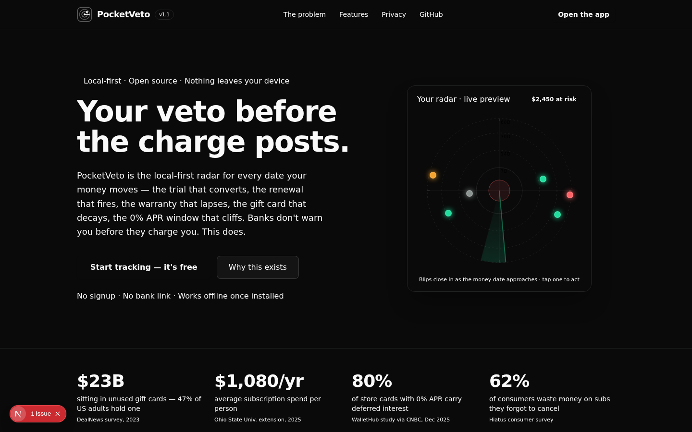
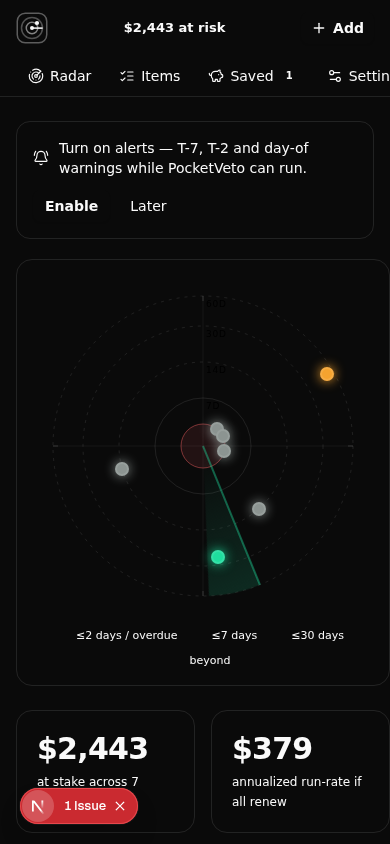

<div align="center">



# PocketVeto

**One radar for every date your money moves.**

Free trials · subscriptions · memberships · warranties · gift cards ·
0% APR windows · passports · IDs · domains — plotted on a live radar
with a `$ at risk` ticker and an action playbook for every item.

[Open the app](https://github.com/srivtx/pocketveto#run-it) · [Why this exists](#why-this-exists-with-receipts) · [Design notes](#design-notes)

[](https://github.com/srivtx/pocketveto/actions/workflows/ci.yml)
[](LICENSE)
[](tests/core.test.ts)
[](CONTRIBUTING.md)
[](#install-it-as-an-app)
[](#privacy-is-an-architecture)

**No account. No bank link. No server.** Everything is stored locally in
your browser (IndexedDB). The only way your data leaves the device is your
own Export button. Free forever, MIT licensed, installable as a PWA.

</div>

---

## Why this exists (with receipts)

The subscription economy runs on **negative-option defaults** — you are
enrolled automatically, staying is the default, and leaving is buried three
menus deep. The industry even has a name for the money you forget:
*breakage*. It is revenue. These are not fringe pains:

- **$21–23B** sits in unused gift cards in the US alone; **47% of US adults**
  hold at least one unused card averaging **$175–187** (DealNews consumer
  surveys, 2022–2023, multiple outlets).
- The average subscriber spends **$1,080/yr** on subscriptions
  (Ohio State University Extension citing industry data, 2025) — and
  consumers systematically *underestimate* that number (West Monroe survey
  series).
- **62%** of consumers waste money on unwanted subscriptions; **70%+ keep
  paying simply because they forget to cancel** (Hiatus consumer survey).
- **52%** of people enter a free trial intending to cancel; only **38%**
  do (Cerillion).
- **80% of store cards with 0% APR offers carry deferred interest**
  (WalletHub 2026 Deferred Interest Study, via CNBC, Dec 2025) — miss the
  payoff by even $1 and interest is charged **retroactively on the original
  balance**. The CFPB has formally flagged the "surprise… high, retroactive
  interest charges."
- Beyond subscriptions: the six-month passport validity rule causes
  boarding denials at the gate (MSN, 2026); expiring domains are harvested
  by watchers within hours, and recovery costs $80–150+ in redemption fees.

### Why the incumbents don't fix it

The category leader (Rocket Money, ex-Truebill) requires **bank linkage**
and has a complaint record over premium-fee billing and high bill-
negotiation fees. The no-bank-link niche that validates the trust barrier
(Subby, ReSubs, Finny, Bobby, SubTracky, PocketSubs, SubTracker) is
**subscriptions-only** and **mobile-app-only** — and SubTracker paywalls
reminders behind a paid Plus tier. Gift-card trackers (VoucherCue) and
warranty trackers exist as thin single-class iOS apps. **Nobody unifies
all money dates**, nobody frames the product around what you're about to
**lose**, and nobody ships it as a local-first installable web app.

Consumers already proved they will track expiry dates — for food
(NoWaste, Fango, and a thriving pantry-app category). This product gives
money the same radar, without handing a startup the keys to your bank.

*Full research pass (17 searches, scoring matrix over 7 candidate
consumer gaps, naming collision checks) lives in the SVX research
corpus: track report R16, `consumer money-dates` lens.*

## What's inside

| Area | What it does |
|---|---|
| **Radar** | Every active item is a blip spiraling inward as its date approaches; blips pop in, travel, and ping when critical. Click a blip to act. Center = now; rings at 7/14/30/60 days. |
| **$-at-risk ticker** | Live sum of money at stake across all active dates + annualized run-rate + "next 7 days" strip. The ticker counts up and glides as items change. Loss-aversion by design. |
| **Playbooks** | Durable cancellation paths (Netflix, Adobe, Amazon Prime, gyms, registrars…), warranty-claim checklists, gift-card redemption steps, generic per-kind fallbacks, and a one-click **cancellation email draft** you can paste into any mail app. |
| **APR cliff calculator** | The monthly payment that clears a deferred-interest window, the months remaining, the retroactive-interest floor if missed, and pace warnings. |
| **Alerts** | T-7 / T-2 / day-of browser notifications while the app or its worker runs, a "while you were away" renewal-lapse report, and a threshold-crossing banner. Honest limits stated in-app. |
| **Data ownership** | Export/import plain JSON, merge-import, one-click sample data, danger-zone clear. Nothing ever leaves the device. |

<div align="center">
   
</div>

## Run it

```bash
git clone https://github.com/srivtx/pocketveto.git
cd pocketveto
bun install          # frozen lockfile verified in CI
bun run dev          # http://localhost:3000
bun test             # 26 core-math tests
bun run lint
```

Any Node/Bun package manager works (`npm i`, `pnpm i`); the repo is
tooling-agnostic, CI uses [Bun](https://bun.sh).

Deploy anywhere Next.js runs (Vercel/Netlify/self-host). There is no
backend, no database, and no environment variables — by design.

### Install it as an app

PocketVeto is a PWA — installable, then works offline:

- **Desktop Chrome/Edge**: install icon in the address bar.
- **Android Chrome**: menu → *Add to Home screen* (installed PWAs may
  keep the alert worker alive in the background).
- **iOS Safari**: Share → *Add to Home Screen* (notifications are the
  most restricted here — see honest limits).

## Architecture in one paragraph

Next.js 16 App Router, single route (`/` = landing, `/#app` = the app).
All state is client-side; persistence is IndexedDB with a localStorage
mirror (`src/lib/pocketveto/store.ts`), so the app works offline once the
service worker caches the shell (`public/sw.js`,
`public/manifest.webmanifest`). The domain logic is pure,
dependency-free TypeScript in `src/lib/pocketveto/` (dates, risk,
interest, playbooks, notifications) and is fully unit-tested — the
deterministic core of the product. The UI is Tailwind 4 + shadcn/ui with
a custom token system and motion primitives (`motion.tsx`) that respect
`prefers-reduced-motion` everywhere.

### Your data format

Exports are plain JSON — documented, versioned, yours:

```json
{
  "kind": "pocketveto.export",
  "version": 1,
  "exportedAt": "2026-10-05T00:00:00.000Z",
  "items": [
    {
      "id": "k3h9…",
      "kind": "trial",
      "name": "Adobe Creative Cloud (7-day trial)",
      "costAtStake": 65.99,
      "start": "2026-09-25",
      "end": "2026-10-06",
      "recurrence": "once",
      "autoAdvance": false,
      "status": "active"
    }
  ]
}
```

Import merges by `id` — existing entries are never overwritten.

## Privacy is an architecture

There is nothing to opt out of, because none of it exists: no accounts,
no analytics, no telemetry, no bank linkage, no server, no push vendor.
The service worker caches the app shell for offline use and nothing else.
If you want the network tab proof: load the app, watch it make zero
requests after the shell.

## Design notes

PocketVeto's interface is "quiet mission control": one signal color on
deep ink, hairline rules, monospaced tabular figures for money, and a
radar as the single hero instrument. Concretely:

- **Tokens over ad-hoc colors** — the palette (ink / mist / signal /
  cliff / warn) lives in `globals.css` as `@theme` tokens; no component
  hard-codes a color outside them.
- **Emoji are not icons** — every item kind maps to a precise Lucide
  glyph (`KindGlyph`), so the interface reads as an instrument, not a
  sticker sheet.
- **Motion with rules** — transform/opacity only, one restrained spring,
  an expo-out settle for everything else, staggered entrances, a count-up
  ticker, a sliding tab indicator, blips that travel when dates move —
  and a global `prefers-reduced-motion` kill switch that makes all of it
  instant.
- **Dark by design** — a radar is a dark-room instrument; the app is
  deliberately dark-only and says so in its metadata.

## Honest limits (v1)

- Browser notifications fire while PocketVeto is open or its background
  worker can run (installed PWAs on Android/desktop do this well; iOS
  Safari is restrictive). v1 deliberately ships **no push server** —
  a self-hostable notifier is the roadmap item for those who want it.
- No receipt photo capture yet (planned).
- Playbook steps are durable paths, not live UI screenshots — vendors
  redesign flows quarterly, so the app names the official entry point
  and the dark patterns to expect.

## Roadmap

- [ ] `.ics` calendar export (get alerts from the calendar you already have)
- [ ] Receipt capture (photo → notes, on-device only)
- [ ] Self-hostable push notifier for people who want server-side alerts
- [ ] More curated playbooks (streaming, ISPs, insurance, registrars)

## Repository layout

```
src/lib/pocketveto/          pure domain logic (types, dates, risk, interest, playbooks, store, alerts, seed)
src/components/pocketveto/   UI (landing, app shell, radar chart, dialog, items, saved, settings, motion)
src/app/                     single-route entry + layout/PWA metadata
public/                      manifest, service worker, icons
tests/core.test.ts           the deterministic core, unit-tested
scripts/gen-icons.mjs        PWA icon generator (SVG → PNG)
docs/screenshots/            product screenshots
```

## Contributing

Bug reports, playbook corrections and new curated playbooks are the
highest-value contributions — vendor flows drift, and the playbooks are
meant to be durable. Run `bun test && bun run lint` before opening a PR;
CI runs the same.

## License

MIT — see [LICENSE](LICENSE). PocketVeto is an organizational tool, not
financial advice.
