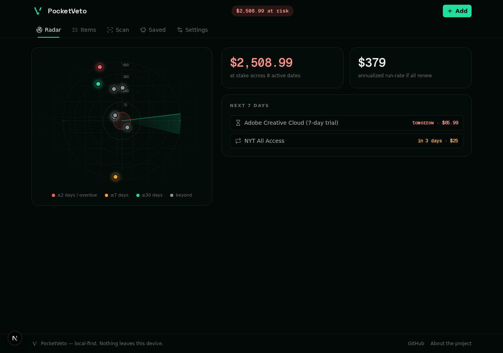

<div align="center">

# PocketVeto

**One radar for every date your money moves.**

[](https://github.com/srivtx/pocketveto/actions/workflows/ci.yml)
[](https://github.com/srivtx/pocketveto/releases)
[](LICENSE)
[](tests/)

</div>

Trials, renewals, warranties, gift cards, 0% APR windows, passports, domains —
every money date as a blip closing in on a live radar, with a `$ at risk`
ticker and an action playbook per item. No account, no bank link, no server:
everything stays on your device.

<div align="center">
  
</div>

## Autopay detection, three ways in

- **Android app** — [download the APK](https://github.com/srivtx/pocketveto/releases/latest/download/PocketVeto-android.apk),
  flip one switch (*Notification access*): PhonePe / GPay / Paytm / bank
  payment notifications become ready-to-track cards, parsed on-device.
- **Share** (installed PWA, Android) — share any payment notification straight in.
- **Paste** — a bank/card statement; recurring charges are found by cadence,
  amount and a local catalog of known subscription brands.

## Run it

```bash
git clone https://github.com/srivtx/pocketveto.git && cd pocketveto
bun install && bun run dev     # http://localhost:3000
bun test                       # 63 tests
```

## Build the Android APK

```bash
bun run build:static           # web export → out/
cd android && gradle assembleRelease   # JDK 17 + Android SDK 35
```

CI builds and signs it on every tag — details in [android/README.md](android/README.md).

---

[Detection ladder](docs/autodetect.md) · [Changelog](CHANGELOG.md) · [Contributing](CONTRIBUTING.md) · MIT

*Local-first by architecture, not policy — the network tab stays silent.*
