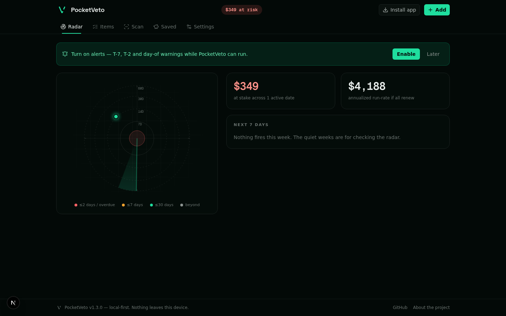
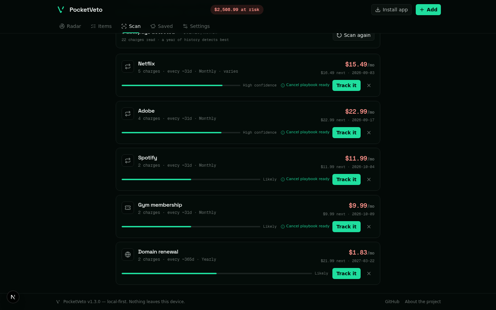
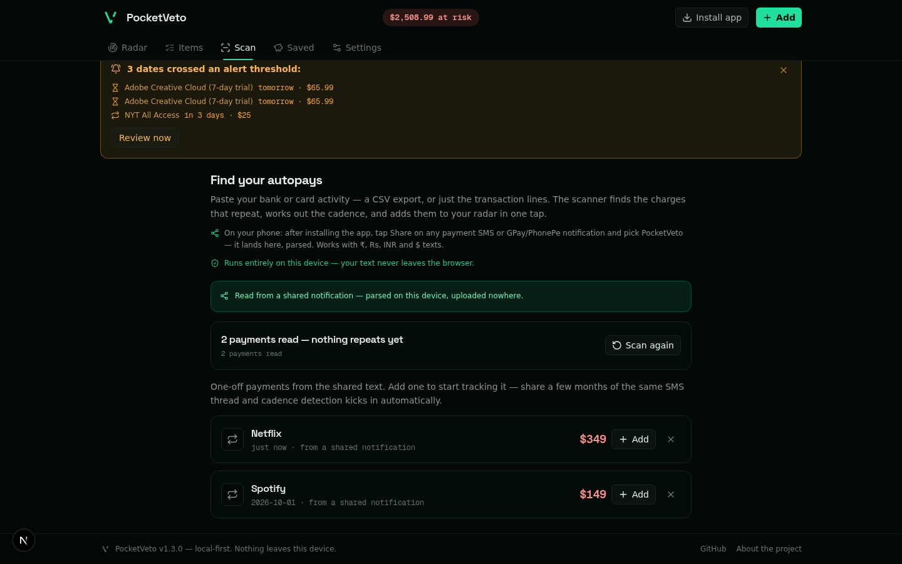

<div align="center">



# PocketVeto

**One radar for every date your money moves.**

Trials, renewals, warranties, gift cards, 0% APR windows, passports,
domains — plotted on a live radar with a `$ at risk` ticker and an
action playbook for every item. Paste a bank statement and it finds
your autopays for you.

[Open the app](#run-it) · [Autopay scan](#autopay-scan-no-bank-link) · [Install as an app](#install-as-an-app)

[](https://github.com/srivtx/pocketveto/actions/workflows/ci.yml)
[](LICENSE)
[](tests/)
[](#install-as-an-app)
[](#privacy-is-an-architecture)
[](CONTRIBUTING.md)

**No account. No bank link. No server.** Your data lives in your
browser and never leaves your device. Free, MIT, installable.

</div>

---

<div align="center">
    
</div>

## What's inside

| Area | What it does |
|---|---|
| **Radar** | Every active item is a blip closing in as its date approaches (rings at 7/14/30/60 days; center = now). Click a blip to act. |
| **Autopay scan** | Share a payment notification from any app straight in (Android share sheet), or paste a bank/card export — the on-device detector finds recurring charges (cadence, next charge, confidence) and tracks them in one tap. ₹/Rs/INR/$ texts parse; promo and OTP SMS never become charges. |
| **$-at-risk ticker** | Live sum of what you're about to lose + annualized run-rate + next-7-days strip. Loss-aversion by design. |
| **Playbooks** | Durable cancel paths (Netflix, Adobe, gyms, registrars…), warranty-claim checklists, a ready-to-send cancellation email, per-kind fallbacks. |
| **APR cliff calculator** | The monthly payment that clears a deferred-interest window — and the retroactive damage if you miss it. |
| **Alerts** | T-7 / T-2 / day-of notifications while the app runs, a "while you were away" lapse report, threshold banners. |
| **Data ownership** | Export/import plain JSON (merge-safe), sample data, danger-zone clear. Nothing ever leaves the device. |

## Autopay scan — no bank link

The subscription trackers that find charges for you want your **bank
login**. PocketVeto does it the other way around — two ways in, both
parsed entirely in your browser:

1. **Share** (installed PWA, Android): tap Share on any payment SMS or
   GPay/PhonePe notification → PocketVeto. The notification reader
   pulls amount, payee and date (`₹349`, `Rs. 1,200.50`, `INR 99`;
   day-first bank-SMS dates; UPI VPA payees like `sonyliv@okhdfcbank`),
   rejects promo/OTP texts, and hands you a ready-to-track card. Share
   a few months of the same SMS thread and cadence detection kicks in.
2. **Paste** your bank or card activity (CSV export, or copied lines):
   the scanner groups charges by merchant, strips bank noise
   (`POS DEBIT`, card numbers, refs), and keeps merchants whose dates
   fit a weekly/monthly/quarterly/yearly rhythm with consistent
   amounts.

Each detected autopay shows cadence, next charge date, monthly cost and
a confidence score. **Track it** turns it into a radar item with the
right recurrence — known brands (Netflix, Adobe, Hotstar, Jio, gyms,
registrars, ~40 more) get their cancel playbook attached.

The honest platform note, in full: a web app cannot read your phone's
notifications or SMS — that's an OS boundary, and it's there for good
reasons. The share sheet is the user-driven bridge (no permissions at
all); the full detection ladder — inbox adapter, an Android
notification-listener companion, bank aggregation — is researched and
mapped in [docs/autodetect.md](docs/autodetect.md).

## Install as an app

PocketVeto is a PWA — installable, then works offline:

- **Android / desktop Chrome & Edge**: tap **Install app** in the header,
  or the install icon in the address bar.
- **iOS Safari**: Share → *Add to Home Screen* (the app shows the path).

Why a PWA and not a Play Store app: one codebase, no store review, no
update lag, works on desktop too. When a native wrapper earns its keep
(a notification-listener detector, for instance), the same code ships
as a Trusted Web Activity — nothing is lost by starting here.

## Run it

```bash
git clone https://github.com/srivtx/pocketveto.git
cd pocketveto
bun install          # frozen lockfile verified in CI; npm/pnpm work too
bun run dev          # http://localhost:3000
bun test             # 41 tests: dates, risk, interest, playbooks, scanner
```

Deploy anywhere Next.js runs. No backend, no database, no environment
variables — by design.

## Privacy is an architecture

No accounts, no analytics, no bank linkage, no server, no push vendor.
Items live in IndexedDB on your device; statement text you scan is
processed locally and never uploaded. Load the app and watch the
network tab stay silent.

## Architecture in one paragraph

Next.js 16 App Router, single route (`/` = landing, `/#app` = the app).
All state is client-side; persistence is IndexedDB with a localStorage
mirror (`store.ts`). Domain logic — dates, risk, deferred interest,
playbooks, alerts, the statement scanner (`scan.ts`) — is pure,
dependency-free TypeScript, fully unit-tested. UI is Tailwind 4 +
shadcn/ui with a custom oklch token system and motion primitives that
respect `prefers-reduced-motion` everywhere. The whole render tree is
hydration-safe (deterministic first paint, `useSyncExternalStore` for
environment-dependent values).

## Roadmap

- [ ] `.ics` calendar export
- [ ] Receipt capture (photo → notes, on-device)
- [ ] Inbox scan adapter (opt-in Gmail, your own Supabase backend —
      rung 2 of [the detection ladder](docs/autodetect.md))
- [ ] Android companion: notification-listener auto-detect (rung 3),
      shipped as a TWA first
- [ ] Opt-in sync via your own Supabase backend (the store layer is
      already the adapter boundary)
- [ ] Self-hostable push notifier
- [ ] More curated playbooks

## Contributing

Bug reports, playbook corrections and new curated playbooks are the
highest-value contributions — vendor flows drift. Run
`bun test && bun run lint` before opening a PR; CI runs the same.

## File map

Every file earns its row.

<!-- FILEMAP:START -->
| File | Role |
|---|---|
| `src/app/page.tsx` | one route, two surfaces — landing `/` and app `/#app`; reads the share-target intent and the hash after hydration, never during |
| `src/app/layout.tsx` | fonts, metadata, manifest wiring |
| `src/app/icon.svg` | the veto cut — favicon |
| `src/app/globals.css` | the design system: oklch tokens, motion primitives (focus-pull reveal, scene dissolve, the breathing glow), reduced-motion discipline |
| `src/lib/pocketveto/types.ts` | the domain model — kinds, recurrences, statuses |
| `src/lib/pocketveto/dates.ts` | date math, ISO-only, timezone-safe |
| `src/lib/pocketveto/risk.ts` | $-at-risk, run-rate, money formatting |
| `src/lib/pocketveto/interest.ts` | the 0% APR cliff calculator |
| `src/lib/pocketveto/playbooks.ts` | curated cancel/claim playbooks + service matching |
| `src/lib/pocketveto/notifications.ts` | T-7 / T-2 / day-of scheduling, permission handling |
| `src/lib/pocketveto/store.ts` | IndexedDB + localStorage mirror — the persistence and adapter boundary |
| `src/lib/pocketveto/scan.ts` | the detector: statement parse → merchant normalization → cadence fit → item; payment-notification parse (₹/Rs/INR, day-first dates, payee grammar) for the share flow |
| `src/lib/pocketveto/seed.ts` | the sample set |
| `src/components/pocketveto/PocketVetoApp.tsx` | app shell — ticker, tabs, banners, dialogs, the share landing |
| `src/components/pocketveto/Landing.tsx` | the landing page — nav, hero radar, proof, quiet footer |
| `src/components/pocketveto/Logo.tsx` | the veto cut mark (currentColor) |
| `src/components/pocketveto/ScanView.tsx` | scan + share surfaces: detected autopays, one-off payment cards |
| `src/components/pocketveto/ItemDialog.tsx` | add/edit dialog, prefill-aware (shared payments save as new) |
| `src/components/pocketveto/ItemsView.tsx` | the items ledger |
| `src/components/pocketveto/RadarChart.tsx` | the radar instrument — SVG rings + sweep, HTML blips for real hit targets |
| `src/components/pocketveto/PlaybookPanel.tsx` | per-kind action playbooks |
| `src/components/pocketveto/SavedSettings.tsx` | saved ledger, settings, export/import |
| `src/components/pocketveto/motion.tsx` | Reveal / count-up primitives, reduced-motion through `useSyncExternalStore` |
| `src/components/pocketveto/useItems.ts` | the store hook — derived views, alerts, sample/import actions |
| `src/components/pocketveto/useInstallPrompt.ts` | install availability without setState-in-effect |
| `src/components/pocketveto/InstallButton.tsx` | honest install CTA (iOS gets the Share-menu path) |
| `src/components/pocketveto/KindGlyph.tsx` | kind iconography |
| `src/components/ui/` | shadcn/ui primitives (Button carries the global press state) |
| `tests/core.test.ts` | dates, risk, interest, playbooks, storage round-trip |
| `tests/scan.test.ts` | statement + shared-payment parsing, cadence fitting, draft conversion |
| `scripts/gen-icons.mjs` | the mark → PWA icon set (sharp) |
| `public/manifest.webmanifest` | PWA manifest + Web Share Target registration |
| `public/sw.js` | the service worker — app-shell cache, nothing else, nowhere else |
| `public/logo.svg` | the veto cut badge tile |
| `docs/autodetect.md` | the detection ladder — share target now, listener and aggregation next |
| `docs/screenshots/` | the evidence for every claim above |
<!-- FILEMAP:END -->

## License

MIT — see [LICENSE](LICENSE). PocketVeto is an organizational tool,
not financial advice.

*Local-first by architecture, not policy — the network tab stays
silent.*
