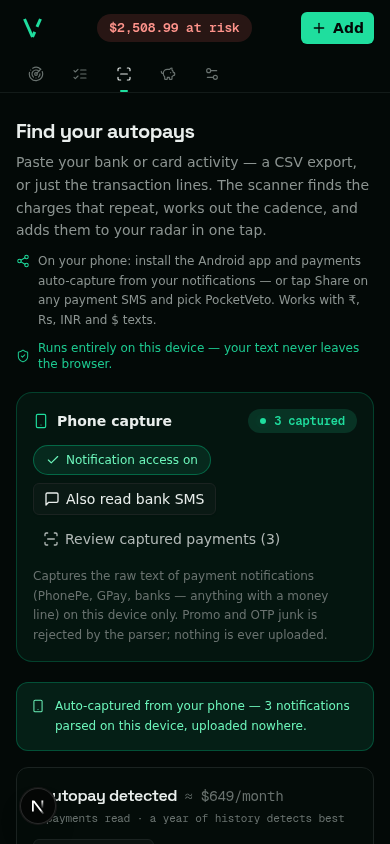

<div align="center">


# PocketVeto

**One radar for every date your money moves.**

[](https://github.com/srivtx/pocketveto/actions/workflows/ci.yml)
[](https://github.com/srivtx/pocketveto/releases)
[](LICENSE)
[](tests/)
[](#run-it)

</div>

Trials, renewals, warranties, gift cards, 0% APR windows, passports, domains —
every money date as a blip closing in on a live radar, with a `$ at risk`
ticker and an action playbook per item. No account, no bank link, no server:
everything stays on your device.

<div align="center">
  
  
  
</div>

## Autopay detection, three ways in

- **Android app** — install the [APK](https://github.com/srivtx/pocketveto/releases),
  allow *Notification access* once: PhonePe / GPay / bank payment notifications
  are captured and parsed on-device into ready-to-track cards. Optional bank-SMS
  reading. No Play Store needed — [why, and how to install safely](docs/autodetect.md).
- **Share** (installed PWA, Android) — share any payment SMS straight in.
- **Paste** — a bank/card statement; the scanner finds what repeats
  (cadence, next charge, confidence), one tap tracks it.

## Run it

```bash
git clone https://github.com/srivtx/pocketveto.git && cd pocketveto
bun install && bun run dev     # http://localhost:3000
bun test                       # 60 tests
```

## Build the Android APK

```bash
bun run build:static           # web export → out/
cd android && gradle assembleRelease   # JDK 17 + Android SDK 35
```

CI builds and signs it on every tag — details in [android/README.md](android/README.md).

---

[Detection ladder](docs/autodetect.md) · [Changelog](CHANGELOG.md) · [Contributing](CONTRIBUTING.md) · MIT

*Local-first by architecture, not policy — the network tab stays silent.*
